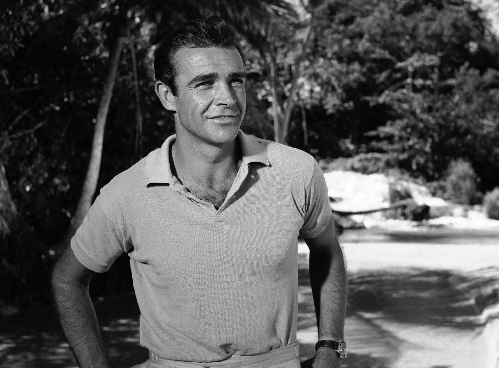

# Something about me
Hello everyone!!
I am Shubhranshu Pattanaik a.k.a Shub 
i am 21 Years old, I was born in odisha.
Stayed at the same place almost all my life.
I Love a good debate, since there isnt much to write about my life or im embarrased to do so,
here's my breakdown of the james bond movie franchise 

**List of official james bond movies**

# Some facts about the movies
* There are twenty-five James Bond Films produced by EON Productions and distributed by United Artists and MGM. The first, Dr. No was released in 1962 and the twenty-fifth installment, No Time to Die, was released in 2021; making it one of the longest-running film series of all time.

* Combined, all 25 released Bond films have a budget of  $1.6 Billion  grossed over $7.0 billion. (Adjusted for 2016 inflation: $16.4 billion

* There are also two additional James Bond films, Casino Royale (1967) and Never Say Never Again as well as a single TV production of Casino Royale. All three of these were adapted directly from Ian Fleming novels and had major deviations from the source material.

# Actors who played james bond 
**********************************

## 1. Sean Connery
------------------

### Movies played :tickets:

1. Dr. No                           1962 
2. From Russia with Love            1963 
3. Goldfinger                       1964 
4. Thunderball                      1965 
5. You Only Live Twice              1967  
6. Diamonds Are Forever             1971 

---------------------------------------------------------------

## 2. George Lazenby
--------------------

### Movies played :tickets:

1.  On Her Majesty's Secret Service  1969 

.webp "George Lazenby")

-------------------------------------------------------------------------------

## 2. Roger Moore
--------------------

### Movies played :tickets:

1. Live and Let Die                 1973 
2. The Man with the Golden Gun      1974 
3. The Spy Who Loved Me             1977 
4. Moonraker                        1979 
5. For Your Eyes Only               1981 
6. Octopussy                        1983 
7. A View to a Kill                 1985 

1.  On Her Majesty's Secret Service  1969 

| Title                            | Year |
|----------------------------------|------|
| Dr. No                           | 1962 |
| From Russia with Love            | 1963 |
| Goldfinger                       | 1964 |
| Thunderball                      | 1965 |
| You Only Live Twice              | 1967 |
| On Her Majesty's Secret Service | 1969 |
| Diamonds Are Forever             | 1971 |
| Live and Let Die                 | 1973 |
| The Man with the Golden Gun      | 1974 |
| The Spy Who Loved Me             | 1977 |
| Moonraker                        | 1979 |
| For Your Eyes Only               | 1981 |
| Octopussy                        | 1983 |
| A View to a Kill                 | 1985 |
| The Living Daylights             | 1987 |
| Licence to Kill                  | 1989 |
| GoldenEye                        | 1995 |
| Tomorrow Never Dies              | 1997 |
| The World Is Not Enough          | 1999 |
| Die Another Day                  | 2002 |
| Casino Royale                    | 2006 |
| Quantum of Solace                | 2008 |
| Skyfall                          | 2012 |
| Spectre                          | 2015 |
| No Time to Die                   | 2021 |
