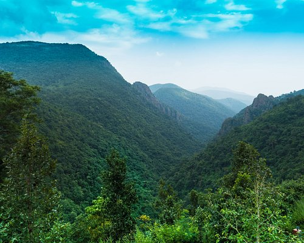
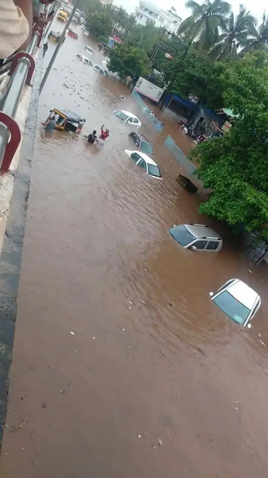
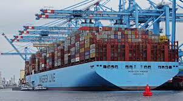
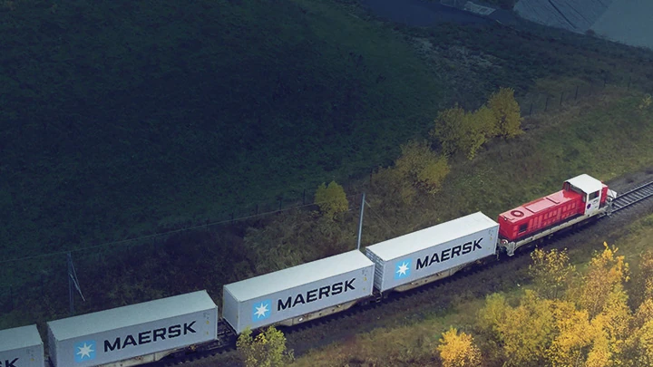
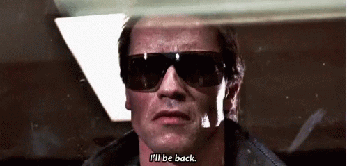

# Introduction

Hello !

* I am shubhranshu Pattanaik 

> How can this be a name? Its just random letters jumbled together.

I also go by *Shub* (For anyone struggling to pronounce my name)

*   I Come from **Odisha**

## Where We Have :arrow_heading_down:

  

##  :arrow_heading_down:

  

##  :arrow_heading_down:

 

## and this too :arrow_heading_down:

  

* I am [21](https://you.regettingold.com/26/12/2001/) years old

* I am an intern at [A.P. Møller – Mærsk](https://www.maersk.com/about) (Danish: [ˈɛˀ ˈpʰe̝ˀ mølɐˈmɛɐ̯sk]), also known simply as Maersk (English: /mɛərsk/ MAIRSK)	:ship: working in the **fbm DevOps and QE team** under **Sudhansu Mohanty**

# What Maersk does: :world_map: 

                                   
                                                  

____________________________________________________________

# Where Maersk Stands: :electron:

  

_____________________________________________________________

# Some Facts on A.P. Moller Maersk 	:ship:

A.P. Møller – Mærsk A/S (Danish: [ˈɛˀ ˈpʰe̝ˀ mølɐˈmɛɐ̯sk]), also known simply as Maersk (English: /mɛərsk/ MAIRSK), is a Danish shipping and logistics company founded in 1904 by Peter Mærsk Møller and Arnold Peter Møller.

* Founded	16 April 1904; 119 years ago, Svendborg, Denmark
* Founders	Arnold Peter Møller
* Peter Mærsk Møller
* Headquarters:	Copenhagen, Denmark 
* Vincent Clerc (CEO)
* Revenue	US$81.5 billion (2022)
* Operating income	US$29.7 billion (2022)
* Net income	US$29.3 billion (2022)
* Total assets	US$93.7 billion (2022)
* Total equity	US$65 billion (2022)
* Number of employees	104,260 (2022)
* Subsidiaries	900+
i have a [chipped tooth](https://www.orovalleydentalarts.com/facts-about-cracked-teeth/) :tooth: 

I mentally adapt to almost all kinds of situations fairly fast and have strong opinions on various topics, and am up for a good debate always.

# Controversial Opinions I Have:

1. Terminator(1984) is a scifi horror movie

This Scene Right here &rarr; 

and This Image &darr; should be enough to prove my point

.jpeg)

Continental Gt-650 has an overcommitted and very unconfortable riding posture

Roger Moore was the worst james bond 

You need to have basic understanding of quantum physics for watching any christopher nolan movies

Never buy anything on sale.

